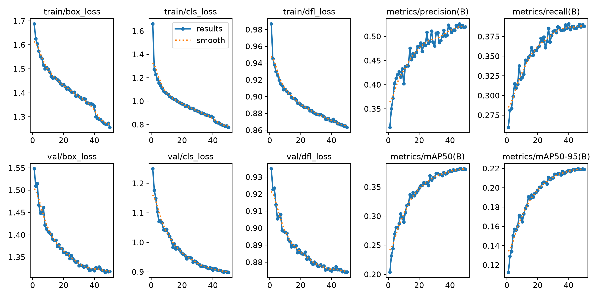
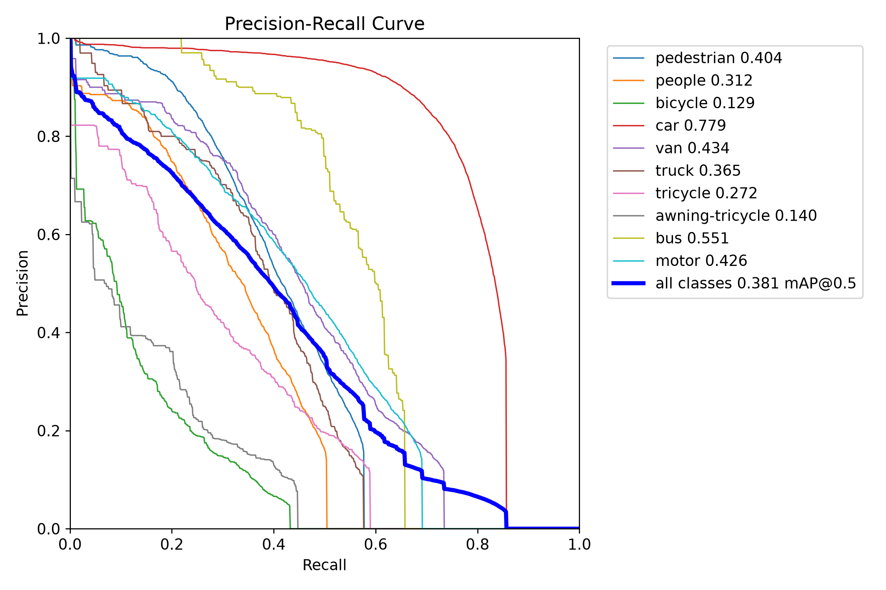

# 无人机视角下的车辆目标检测

本项目基于 **Ultralytics YOLOv8** 完成 VisDrone2019-DET 数据集上的无人机视角目标检测，包含原始标注转换、数据检查、YOLOv8s baseline 训练、验证、预测可视化和实验结果归档。

本文档是项目的主要使用入口。队友按照“准备环境 -> 放置数据和权重 -> 转换数据 -> 检查数据 -> 训练/推理”的顺序即可复现实验。

## 项目状态

- 已完成 VisDrone train/val 到 YOLO 格式的转换脚本。
- 已完成数据完整性检查和随机标注可视化脚本。
- 已完成 YOLOv8s、640 输入尺寸、50 epochs baseline。
- Baseline 最佳 epoch 为 46，mAP50 为 0.38128，mAP50-95 为 0.21975。
- Git 仓库仅保存代码、配置、环境快照和精选结果，不保存数据集及模型权重。

## 工程结构

```text
无人机视角下的车辆检测/
├── configs/
│   └── visdrone.yaml              # Ultralytics 数据集配置
├── scripts/
│   ├── convert_visdrone_to_yolo.py # VisDrone 标注转换
│   └── check_dataset.py           # 数据统计、校验和可视化
├── docs/
│   ├── baseline_results/          # Git 中保留的精选 baseline 结果
│   └── environment/               # 环境命令的原始输出
├── datasets/                      # 本地数据集，不提交 Git
│   ├── VisDrone/                  # 原始 VisDrone 数据
│   └── VisDrone_YOLO/             # 转换后的 YOLO 数据
├── weights/                       # 本地预训练权重，不提交 Git
├── runs/                          # 训练、验证和预测输出，不提交 Git
├── export_env.py                  # 打印当前 Python/CUDA/包版本
├── requirements.txt              # 当前环境的完整 pip 版本快照
├── experiments_log.md             # 实验编号、指标和结论台账
└── README.md                      # 项目总说明
```

## 协作与目录约定

为保证不同实验可以比较，请遵循以下约定：

1. 原始数据只放在 `datasets/VisDrone/`，转换脚本不会修改原始标注。
2. 转换后的数据统一放在 `datasets/VisDrone_YOLO/`。
3. 预训练模型统一放在 `weights/`，命令中必须使用明确的本地路径，例如 `model=weights/yolov8s.pt`，避免自动联网下载。
4. 实验输出统一放在 `runs/<实验类型>/<实验名称>/`，不同实验不得复用同一名称。
5. 每完成一个有效实验，在 `experiments_log.md` 中增加编号、配置、路径、指标和结论。
6. 需要提交 Git 的结果图先复制到 `docs/`，不要提交整个 `runs/`。
7. 不提交数据集、`.pt` 权重、缓存、训练日志和 IDE 私有配置。

建议后续实验编号：

```text
E00  baseline
E01+ 分辨率实验
E10+ 数据增强实验
E20+ 模型结构改进实验
```

## 环境要求

Baseline 实际运行环境如下：

| 项目 | 版本或型号 |
| --- | --- |
| 操作系统 | Windows 11 (`10.0.26200`) |
| Conda 环境名 | `mypytorch` |
| Python | 3.12.7 |
| GPU | NVIDIA GeForce RTX 4060 Laptop GPU 8GB |
| NVIDIA 驱动 | 591.86 |
| 驱动支持的 CUDA | 13.1 |
| PyTorch 构建 CUDA | 11.8 |
| torch | 2.3.1+cu118 |
| torchvision | 0.18.1+cu118 |
| ultralytics | 8.4.66 |
| numpy | 1.26.4 |
| opencv-python | 4.13.0.92 |

`nvidia-smi` 中的 CUDA 13.1 表示驱动支持能力，PyTorch 实际使用的是 cu118。二者不同是正常现象。

### 快速复现环境

```powershell
conda create -n mypytorch python=3.12.7 -y
conda activate mypytorch
python -m pip install --upgrade pip
python -m pip install -r requirements.txt --extra-index-url https://download.pytorch.org/whl/cu118 --no-deps
python export_env.py
yolo checks
```

`requirements.txt` 是当前环境 69 个 pip 包的精确快照。使用 `--no-deps` 是为了避免 pip 自动替换已经验证过的版本组合。

当前环境存在一项已知元数据冲突：`opencv-python 4.13.0.92` 声明需要 NumPy 2.x，但实际环境为 NumPy 1.26.4。这组版本已成功完成数据检查、smoke test 和 50 epochs baseline。若要升级 NumPy 或 OpenCV，请新建环境并重新验证，不要直接改变 baseline 环境。

环境原始输出位于 [`docs/environment/`](docs/environment/)：

- `python_version.txt`：`python --version`
- `pip_list.txt`：`pip list`
- `nvidia_smi.txt`：`nvidia-smi`
- `yolo_checks.txt`：`yolo checks`
- `export_env_output.txt`：`python export_env.py`

## 准备数据集

Git 仓库不包含 VisDrone 数据。请自行下载 VisDrone2019-DET，并按以下结构放置：

```text
datasets/VisDrone/
├── VisDrone2019-DET-train/
│   ├── images/
│   └── annotations/
├── VisDrone2019-DET-val/
│   ├── images/
│   └── annotations/
└── VisDrone2019-DET-test-dev/
```

本项目 baseline 使用：

- 训练集：6471 张图片
- 验证集：548 张图片
- 类别数：10

类别定义：

| YOLO ID | 类别 |
| ---: | --- |
| 0 | pedestrian |
| 1 | people |
| 2 | bicycle |
| 3 | car |
| 4 | van |
| 5 | truck |
| 6 | tricycle |
| 7 | awning-tricycle |
| 8 | bus |
| 9 | motor |

## 数据转换

VisDrone 原始标注格式为：

```text
bbox_left,bbox_top,bbox_width,bbox_height,score,object_category,truncation,occlusion
```

运行转换：

```powershell
conda activate mypytorch
python scripts/convert_visdrone_to_yolo.py
```

自定义输入和输出路径：

```powershell
python scripts/convert_visdrone_to_yolo.py --source datasets/VisDrone --output datasets/VisDrone_YOLO
```

转换规则：

- 忽略 `object_category == 0` 的 ignored regions。
- 忽略 `score == 0` 的目标。
- 忽略宽或高小于等于 0 的框。
- 将类别转换为 `YOLO ID = object_category - 1`。
- 将越界框裁剪到图像范围内，裁剪后无效的框会被跳过。
- 输出归一化的 `class x_center y_center width height`。
- 使用复制方式生成 YOLO 图片目录，不移动或修改原始数据。

输出结构：

```text
datasets/VisDrone_YOLO/
├── images/
│   ├── train/
│   └── val/
└── labels/
    ├── train/
    └── val/
```

## 数据检查

```powershell
python scripts/check_dataset.py
```

可选参数：

```powershell
python scripts/check_dataset.py --dataset datasets/VisDrone_YOLO --output runs/dataset_check --samples 5 --seed 42
```

脚本会输出：

- train/val 图片数量和标签数量
- 空标签数量
- 有图无标签及有标签无图数量
- 10 个类别的实例数量
- 随机标注可视化图片

本次转换结果：

| 子集 | 图片 | 标签 | 空标签 | 有效实例 |
| --- | ---: | ---: | ---: | ---: |
| train | 6471 | 6471 | 0 | 343204 |
| val | 548 | 548 | 0 | 38759 |

## 主要脚本与函数

### `scripts/convert_visdrone_to_yolo.py`

- `convert_split(source_root, output_root, split)`：转换单个 train/val 子集，读取图像尺寸、过滤无效标注、裁剪边界框、写入 YOLO 标签并复制图片；返回转换统计。
- `parse_args()`：定义 `--source` 和 `--output` 命令行参数。
- `main()`：依次转换 train 和 val，并打印各类实例及过滤统计。

### `scripts/check_dataset.py`

- `read_labels(label_path)`：解析并校验 YOLO 标签，检查字段数、类别 ID 和归一化坐标范围。
- `inspect_split(dataset_root, split)`：统计图片、标签、空标签、缺失对应项和类别实例数量。
- `render_sample(image_path, label_path, output_path)`：将检测框和类别绘制到图片并保存。
- `parse_args()`：定义数据目录、输出目录、样本数和随机种子。
- `main()`：检查 train/val，并随机生成可视化样本。

### `export_env.py`

- `package_version(distribution, fallback)`：通过 Python 包元数据读取安装版本。
- `main()`：打印 Python、操作系统、CUDA、GPU、torch、torchvision、Ultralytics、NumPy 和 OpenCV 信息。

## 数据配置

[`configs/visdrone.yaml`](configs/visdrone.yaml) 是 Ultralytics 数据入口：

```yaml
path: ../datasets/VisDrone_YOLO
train: images/train
val: images/val
```

所有训练和验证命令应使用 `data=configs/visdrone.yaml`，不要在多人环境中写个人电脑的绝对数据路径。

## Baseline 训练

下载官方 YOLOv8s 预训练权重并放到：

```text
weights/yolov8s.pt
```

先进行 1 epoch smoke test：

```powershell
yolo detect train model=weights/yolov8s.pt data=configs/visdrone.yaml imgsz=640 epochs=1 batch=8 workers=4 device=0 project=runs/baseline name=yolov8s_pretrained_smoke
```

正式 baseline：

```powershell
yolo detect train model=weights/yolov8s.pt data=configs/visdrone.yaml imgsz=640 epochs=50 batch=8 workers=4 device=0 project=runs/baseline name=yolov8s_visdrone_640
```

Baseline 配置：

| 参数 | 值 |
| --- | --- |
| 实验名 | YOLOv8s_VisDrone_640_baseline |
| 初始权重 | `weights/yolov8s.pt` |
| imgsz | 640 |
| epochs | 50 |
| batch | 8 |
| workers | 4 |
| device | 0 |
| GPU | RTX 4060 Laptop 8GB |
| 总耗时 | 1.377 小时 |
| OOM | 无 |

模型在 10 类 VisDrone 数据上重建检测头后的结构摘要：

| 项目 | 数值 |
| --- | ---: |
| 网络层数 | 130 |
| 参数量 | 11,139,470 |
| 可训练梯度参数 | 11,139,454 |
| 计算量 | 28.7 GFLOPs |
| 检测尺度 | P3 / P4 / P5 |
| 预训练参数迁移 | 349 / 355 items |

YOLOv8s 主干和颈部使用 Conv、C2f、SPPF、Upsample 与 Concat 模块，Detect head 已由 COCO 的 80 类调整为 VisDrone 的 10 类。项目没有修改 Ultralytics 源码，baseline 的结构、损失、增强和优化器行为均由当前 Ultralytics 版本管理。

AMP 自检曾尝试下载 `yolo26n.pt`，联网失败后自动跳过，正式训练未受影响。数据扫描时 4 张图片各移除了 1 个重复标签。

## Baseline 结果

最佳 epoch：**46**。

| Precision | Recall | mAP50 | mAP50-95 |
| ---: | ---: | ---: | ---: |
| 0.52613 | 0.38791 | 0.38128 | 0.21975 |

各类别结果：

| 类别 | mAP50 | mAP50-95 |
| --- | ---: | ---: |
| pedestrian | 0.404 | 0.173 |
| people | 0.312 | 0.110 |
| bicycle | 0.129 | 0.0514 |
| car | 0.779 | 0.530 |
| van | 0.434 | 0.298 |
| truck | 0.365 | 0.241 |
| tricycle | 0.272 | 0.148 |
| awning-tricycle | 0.140 | 0.0879 |
| bus | 0.551 | 0.379 |
| motor | 0.426 | 0.177 |

精选结果位于 [`docs/baseline_results/`](docs/baseline_results/)：

- `results.csv`：50 epochs 指标记录
- `results.png`：训练与验证损失、指标曲线
- `confusion_matrix.png`：混淆矩阵
- `BoxPR_curve.png`：各类别 PR 曲线
- `val_batch0_pred.jpg`：验证集预测示例





## 使用最佳权重预测

训练完成后，对 val 集生成可视化：

```powershell
yolo detect predict model=runs/baseline/yolov8s_visdrone_640/weights/best.pt source=datasets/VisDrone_YOLO/images/val imgsz=640 conf=0.25 save=True project=runs/predict name=baseline_val_vis
```

对单张图片预测：

```powershell
yolo detect predict model=runs/baseline/yolov8s_visdrone_640/weights/best.pt source=path/to/image.jpg imgsz=640 conf=0.25 save=True project=runs/predict name=single_image
```

## 队友需要准备的内容

从 Git 获取：

- `README.md`
- `requirements.txt`
- `export_env.py`
- `configs/`
- `scripts/`
- `docs/`
- `experiments_log.md`

自行准备：

- VisDrone2019-DET 原始数据集
- `weights/yolov8s.pt` 预训练权重
- 支持 CUDA 的 NVIDIA 驱动
- 足够的磁盘空间用于转换后的数据和训练输出

无需互相传输：

- `datasets/`
- `weights/`
- `runs/`
- `best.pt`、`last.pt`
- `.matplotlib/`、`__pycache__/` 等缓存
- VSCode 本地配置和完整控制台日志

## 常见问题

### 为什么必须写 `model=weights/yolov8s.pt`？

只写 `model=yolov8s.pt` 时，如果当前目录找不到权重，Ultralytics 会尝试联网下载。使用明确的本地路径可以保证实验来源一致。

### CUDA OOM 怎么处理？

Baseline 在 8GB RTX 4060 上使用 `batch=8` 成功。如果其他显卡显存不足，可将 batch 改为 4，但这应记录为新的实验配置，不应覆盖 E00 baseline。

### AMP 自检下载失败怎么办？

若提示无法下载 `yolo26n.pt`，但日志显示 AMP checks skipped 且训练继续，可以忽略。若因此中断，可在新实验中增加 `amp=False` 并记录差异。

### Windows 终端中文乱码怎么办？

```powershell
$env:PYTHONIOENCODING="utf-8"
$env:PYTHONUTF8="1"
chcp 65001
```

### 结果目录被重复嵌套怎么办？

Ultralytics 用户设置中的 `runs_dir` 可能影响相对 `project`。优先从项目根目录执行命令；需要严格指定位置时，可给 `project` 传项目内绝对路径。

## Git 发布范围

`.gitignore` 已排除数据集、权重、完整运行输出、缓存和日志。提交前检查：

```powershell
git status
```

实验记录请持续追加到 [`experiments_log.md`](experiments_log.md)，不要只在聊天或个人笔记中保存结果。
